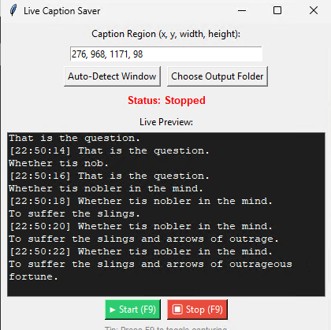

# 🗣️ Live Caption Saver (Windows)

A lightweight Python desktop app that captures real-time text from the **Windows Live Captions** window and saves it with timestamps to a text file — perfect for accessibility, transcription, and meeting notes.


---

## 📸 Screenshots

| App Interface | Live Capturing |
|---|---|
| 

---

## ✨ Features

- Auto-detect the **Live Captions** window and set the capture region automatically
- Smart OCR filtering — ignores garbage characters and only saves real sentences
- Live preview window with auto-scroll so you can read captions as they're captured
- Saves captions to a `.txt` file organized by date
- Start/Stop with the **F9 hotkey** or the GUI buttons
- Lightweight and runs in the background

---

## 📦 Requirements

- Windows 10 or 11
- Python 3.8+
- [Tesseract OCR (UB Mannheim Build)](https://github.com/UB-Mannheim/tesseract/wiki)

---

## 🛠️ Installation

### 1. Install Tesseract OCR

Download and install the UB Mannheim build:

➡️ [Download Tesseract](https://github.com/UB-Mannheim/tesseract/wiki)

> Leave the default install path as-is:
> `C:\Program Files\Tesseract-OCR\tesseract.exe`

### 2. Install Python packages

```bash
pip install pytesseract pillow mss opencv-python pygetwindow pywin32
```

### 3. Run the app

```bash
python caption_saver_gui.py
```

---

## 🚀 How to Use

1. Open **Windows Live Captions** (Windows 11 built-in or Windows 10 via accessibility settings)
2. Run the app with `python caption_saver_gui.py`
3. Click **Auto-Detect Window** to automatically set the capture region
4. Click **Choose Output Folder** to pick where captions are saved
5. Press **F9** or click **Start** to begin capturing
6. Captions appear in the live preview and are saved to a `.txt` file in real time
7. Press **F9** or click **Stop** when done

---

## 📁 Project Structure

```
Live-Caption-Saver/
├── caption_saver_gui.py    # GUI layer
├── caption_logic.py        # OCR processing, filtering, file saving
├── config.py               # All settings in one place
├── test_app.py             # Automated tests
├── requirements.txt        # Python dependencies
└── .github/
    └── workflows/
        └── tests.yml       # GitHub Actions CI pipeline
```

---

## ⚙️ Configuration

All settings are in `config.py` — no need to dig through code:

| Setting | Default | Description |
|---|---|---|
| `TESSERACT_PATH` | `C:\Program Files\Tesseract-OCR\tesseract.exe` | Path to Tesseract |
| `CAPTURE_INTERVAL` | `1.5` seconds | How often the screen is captured |
| `OCR_CONTRAST` | `2.5` | Image contrast enhancement level |
| `HOTKEY` | `F9` | Keyboard shortcut to toggle capture |

---

## 🧪 Testing

This project uses **pytest** with GitHub Actions CI that runs on every push.

```bash
pip install pytest pillow
pytest
```


Tests cover region parsing, image preprocessing, text filtering, file saving, and folder validation — all without needing Tesseract or Windows installed.

---

## 🔧 Troubleshooting

**Captions not being detected**
- Make sure Windows Live Captions is open and visible on screen
- Click Auto-Detect Window to refresh the capture region
- Try adjusting the region manually if the window has moved

**Tesseract not found error**
- Check that Tesseract is installed at `C:\Program Files\Tesseract-OCR\tesseract.exe`
- If installed elsewhere, update `TESSERACT_PATH` in `config.py`

**Garbage text appearing**
- The app filters out short and low-quality OCR results automatically
- If noise persists, increase `OCR_CONTRAST` in `config.py`

---

## 👤 Author

**Tezz** — Automation Engineer | Python & Next.js Developer

[](https://linkedin.com/in/letezz-khan-722397159/)
[](mailto:letezzkhan@gmail.com)
